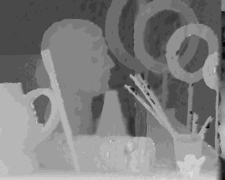
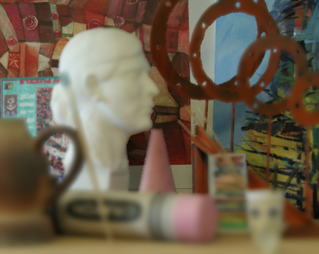
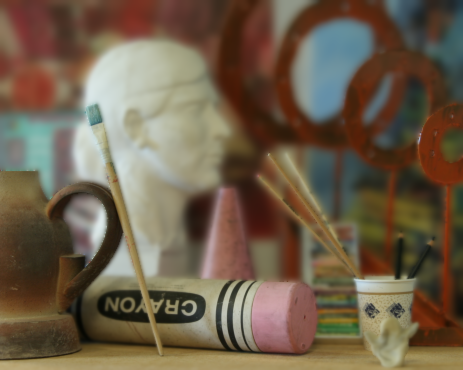

Adaptive Depth of Field
====

Adaptive Depth of Field (ADOF) using variational models and nonlinear inhomogeneous isotropic diffusion.

Zorah Lähner 
laehner@in.tum.de 

Tobias Gurdan 
tobias@gurdan.de 

Description
===

In the context of a practical CUDA programming course for computer vision problems at TUM, we set out and created an imho super awesome method to achieve a sense of depth in images.
To this end, given a stereo image pair we first **compute a disparity map** according to the variational models introduced in *Global Solutions of Variational Models with Convex Regularization* by Thomas Pock et al. (2010), implemented in an efficient CUDA kernel.
We then incorporate the depth information into a **nonlinear isotropic diffusion** process (again computed on the GPU), which in consequence adapts the strength of diffusion to the current pixel's disparity.
The result of this inhomogeneous diffusion process is an image with an artificial depth of field effect.
We also implemented a **gui**, where the user can **click at a point** in the image to set it in focus.
Fore- and background will blur accordingly.
Also, the strength of the effect can be adjusted.
